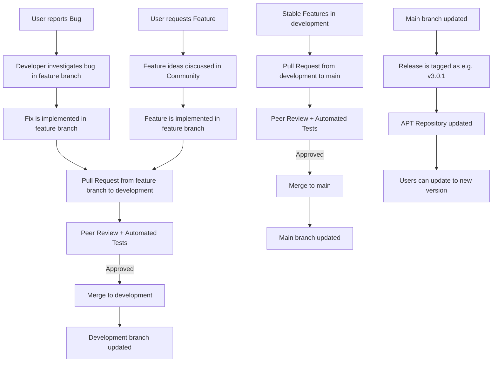

# Contributing Guidelines

## Communication
English is the official language of Astroberry Project. All documentation, discussions, issue reports, pull requests, and communication should be in English.

## Contact
The most reliable way to contact us is via our [Discord server](https://discord.gg/Bzhm24VgQu). You can also reach us via [GitHub Discussions](https://github.com/astroberry-official/astroberry-os/discussions) or [GitHub Issues](https://github.com/astroberry-official/astroberry-os/issues) or our [social media channels](https://astroberry.io/community/). Email is the least effective way to contact us.

## How to contribute
There are many ways to contribute to Astroberry Project:

- Reporting bugs
- Requesting features
- Submitting pull requests
- Writing documentation
- Contributing to existing features
- Developing new features
- Testing the software

There are also other ways to contribute to Astroberry Project:

- Share your experience with Astroberry OS on social media channels, blogs, forums, etc.
- Help other users on Discord server or other social media channels
- Share computing power for building the system and its packages. If you have a spare Raspberry Pi or Intel/AMD x86_64 PC or a server and would like to share its computing power as a self-hosted runner for [GitHub Actions](https://github.com/astroberry-official/astroberry-os/actions/) please contact us. 

### Did you find a bug?
If you encounter a bug, please open an issue in the [issues tracker](https://github.com/astroberry-official/astroberry-os/issues). Provide as much detail as possible about the bug, including steps to reproduce it, what you expected to happen, what actually happened, and any relevant context. Do not provide any log files or private data in the issue, unless specifically requested.

### Did you write a patch that fixes a bug?
Open a new GitHub pull request with the patch. The PR should provide as much detail as possible about the change, including its intended behavior, potential impact, and any relevant context. Include the relevant issue number if applicable.

### Did you fix whitespace, format code, or make a purely cosmetic patch?
Changes that are cosmetic in nature and do not add anything substantial to the stability, functionality, or testability of Astroberry will generally not be accepted. We do our own housekeeping on a regular basis.

### Do you intend to add a new feature or change an existing one?
Suggest your feature or change by opening an issue in the [issues tracker](https://github.com/astroberry-official/astroberry-os/issues). The issue should provide as much detail as possible about the proposed change, including its intended behavior, potential impact, and any relevant context. collecting feedback from the community is recommended. Do not start coding until you have collected positive feedback about the change.

## Branching strategy
All repositories in Astroberry Project follow simple yet effective branching strategy and feature branch workflow.

### Branches
- **main** - stable, production ready code is kept in the main branch.
- **development** - integration, final review and merging of feature branches happens in the development branch.
- **feature/branch-name** or **fix/branch-name** - actual feature and bugfix development happens in feature branches, which are created from the latest **development** branch. Other types of development tasks, such as documentation updates, can be introduced directly to development branch by maintainers.
- **testing** - test builds are made from testing branch, which is a copy of **development** branch and uses testing debian repository.

#### Main
- No direct changes to main are allowed.
- Changes to main are allowed only as pull request from development.
- Only selected team members are authorized to merge pull requests from development
- Each release is marked with a version tag i.e. v3.1 

#### Development
- Direct changes to development should be avoided.
- Changes to development should be merged from pull request from feature branches.
- Changes from development are promoted to main as pull requests from development.
- Only selected team members are authorized to merge pull requests from feature branches

#### Features
- Feature branches should be created from the latest development branch.
- Feature branches are created for every **type** of task i.e. feature, bugfix, task.
- Naming convention of feature branches should follow the pattern **type/feature-name** e.g. feature/telescope-control or fix/telescope-control.
- Changes to a feature branch are pushed directly.
- Feature branches are short-lived and deleted after merging with development.
- Any team member can create, introduce changes and create pull request from a feature branch.

### Branch Protection Rules
As to keep things in order, certain rules are enforced and followed by contributors and developers.
- Restrict pushes: Explicitly ban everyone from pushing directly to main.
- Require Pull Request reviews: Ensure at least one other person approves the code.
- Require status checks to pass: Ensure that automated tests/builds pass before the "Merge" button becomes active.

### Branch Workflow
#### Step 1: Clone Repository
- Clone the repository: `git clone <repository-url>`

#### Step 2: Sync and Branch
Always start by ensuring your local environment matches the latest state of **development** branch.
- Switch to development: `git checkout development`
- Pull latest changes: `git pull origin development`
- Create a new feature branch: `git checkout -b feature/your-feature-name`

#### Step 3: Develop and Commit
Work on your changes in the feature branch. Keep your commits atomic (one logical change per commit) with clear descriptive messages.

#### Step 4: The Pull Request (PR) to development
Once your feature is complete:
- Push your branch to the remote: `git push origin feature/your-feature-name`
- Open a Pull Request targeting the **development** branch. **DO NOT TARGET MAIN BRANCH!**
- Peer Review: This is where your code is checked for bugs, security vulnerabilities, style inconsistencies etc.
- Tests are run to ensure your changes don't break existing functionality.

#### Step 5: Integration and Release
Once features are stable and tested in development branch:
- A PR is opened from development into main.
- Since main is protected, this PR serves as the final "release" gate.
- At certain intervals, a new release is created from main branch by creating a new tag (e.g., v3.0.1).

### Workflow Summary

## Code of Conduct
We are committed to providing a friendly, safe, and welcoming environment for all, regardless of background or identity. We expect all contributors to abide by our Code of Conduct.
